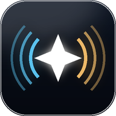

<div align="center">



# Spark Live

**Live speech → self-correcting transcript → translated for your audience, in real time.**

A speaker talks. Everyone in the room opens a link on their own phone and reads
along in **their own language** — Dari, English, Chinese, Pashto, Arabic and more.

No app install. No accounts. No server to run.

</div>

---

## Why this exists

Real-time translation tools force an unhappy trade:

- **Stream every partial** (what most live translators do) → text appears fast, but it
  flickers and rewrites constantly, and terminology drifts sentence to sentence.
- **Wait for whole sentences** → accurate, but the audience stares at nothing for
  10–15 seconds.

Spark Live does neither. It splits the screen into **two zones with different
update rules**, so text arrives immediately *and* settles into something accurate.

---

## How it works

```
  microphone
      │
      ▼
  ┌─────────────────────────────────────────────────────────┐
  │  1. CAPTURE — raw 16 kHz PCM via AudioWorklet           │
  └─────────────────────────────────────────────────────────┘
      │  (raw PCM, not MediaRecorder — see "Design notes")
      ▼
  ┌─────────────────────────────────────────────────────────┐
  │  2. STABILISE — LocalAgreement                          │
  │     re-transcribe the uncommitted tail every ~2.2 s;    │
  │     commit ONLY the words two passes agree on           │
  └─────────────────────────────────────────────────────────┘
      │
      ├──► live tail  ──► cheap provisional translation ──┐
      │                   (small fast model, throttled)   │
      ▼                                                   ▼
  ┌─────────────────────────────────────────────────────────┐
  │  3. CORRECT + TRANSLATE — one call, quality model       │
  │     fixes ASR errors against your glossary AND          │
  │     translates, so errors don't compound                │
  └─────────────────────────────────────────────────────────┘
      │
      ▼
  relay ──► audience phones (each picks their own language)
```

### The two zones

| Zone | Updates | Cost |
|---|---|---|
| **Settled lines** | Translated **once**, then never touched | Linear in words spoken |
| **Live tail** (one line) | Raw text every ~2.2 s + a cheap provisional translation | Small, throttled |

Nothing the audience has already read ever moves. Corrections are confined to the
single in-progress line.

### LocalAgreement, briefly

Two independent transcription passes over overlapping audio will disagree exactly
where the audio was ambiguous. So: commit the leading words where consecutive
passes **agree**, leave the rest provisional, and use word-level timestamps to trim
precisely the audio that was committed. Text visibly *sharpens* rather than being
wrong and then rewritten wholesale.

---

## Accuracy

Ranked by how much they actually move the needle:

1. **The glossary.** Names, places, scripture books, jargon — with their target-language
   spellings. This is worth more than upgrading to a pricier model. It's injected into
   every correction call (filtered to only the terms present in that sentence, to keep
   token use down).
2. **Pin the source language** when the talk is monolingual — auto-detect flips on short windows.
3. **Session context** ("Sunday sermon, Romans 8, speaker …").
4. **Rolling prior-sentence context**, so pronouns and terminology stay consistent.

### Why translate whole clauses, not word-by-word

Persian/Dari word order differs enough from English and Chinese that fragments
translate badly. Units are emitted on sentence punctuation, on clause punctuation
once the clause is long enough to stand alone, or after a hard timeout — but never
mid-clause purely to look fast.

---

## Setup

```bash
npm install
netlify deploy --prod --dir=public --functions=netlify/functions
```

### Two ways to supply keys

**Hosted** — set `GROQ_KEY_POOL` (comma-separated) as a Netlify environment variable.
The browser then calls `/api/asr` and `/api/chat`, which add a key server-side, and
the site works with **no setup for the presenter at all**. The key never reaches the
browser. Enable it by shipping `window.SPARK_LIVE_CONFIG = { proxy: true }`.

> There is no way to put a key *in* a browser app and hide it — anything the page can
> use, a visitor can read from DevTools. A proxy is the only real answer.

Optionally set `SPARK_ACCESS_CODE` to gate the proxy; callers then need that code.
Leave it unset and the endpoints are open — with a free-tier pool the worst case is a
drained daily quota rather than a bill, but set it if the URL travels.

**Bring your own key** — keys entered in the app are stored in `localStorage` **on the
presenter's device only**. They are never sent to the relay and never leave the browser
except to the AI provider itself. A key entered here overrides the hosted pool.

- **Groq** — required. Powers both speech recognition and translation.
- Gemini / Kimi / GLM — optional fallbacks, used only if the primary is rate-limited.

**For a long talk, add more than one Groq key.** Groq's free tier meters speech
recognition in **requests per day, per key** (2,000), and the stabiliser spends one
roughly every 2.2 seconds — so a multi-hour service needs more than one key's
budget. Paste extras into *Advanced → Backup keys → More Groq keys*, one per line.
They are **round-robined**, so every key stays comfortably inside its own quota
instead of one being driven into a `429`; any key that does get throttled is
benched for its `retry-after` and skipped until it recovers.

> A `public/config.js` defining `window.SPARK_LIVE_CONFIG = { groqKey: "…" }` will
> pre-fill the fields, which is handy for a private test rig. It is gitignored, but
> **anything in it is publicly readable on a deployed site** — use hosted mode above
> for anything real.

---

## Design notes

**Raw PCM, not MediaRecorder.** The stabiliser needs arbitrary *overlapping* windows.
MediaRecorder emits webm/opus chunks where everything after the first lacks headers
and can't be decoded standalone, so an AudioWorklet captures raw PCM instead.

**CDN-collapsed polling.** `netlify.toml` puts `s-maxage=1` on the audience feed, so
the CDN answers nearly every viewer poll and the function runs about once per second
**regardless of audience size**. A full room stays inside a free tier.

**Pluggable transport.** All networking lives in `public/channel.js`. Swapping to a
websocket service means rewriting that one file.

**Token-claimed sessions.** The first publish claims a session code with a device
token; a different device publishing to the same code gets `409`. The token is
stripped before anything reaches viewers.

**Rate limits shape the design.** Per-key daily request caps, not price, are the real
constraint on a long talk. Each extra target language multiplies output tokens, so
the picker caps at three and warns. The provider chain falls back automatically from
a high-quality model to a high-throughput one.

---

## Layout

```
live/
├─ public/
│  ├─ index.html      presenter console
│  ├─ view.html       audience view
│  ├─ engine.js       capture · LocalAgreement · ASR · correct+translate
│  ├─ channel.js      the only networking — swap this to change transport
│  ├─ presenter.js    console UI, session lifecycle
│  ├─ viewer.js       audience UI
│  └─ i18n.js         interface language (EN · دری · 中文)
└─ netlify/functions/
   ├─ publish.mjs     presenter → store
   ├─ feed.mjs        audience ← store
   ├─ keys.mjs        server-side key pool + rotation (shared helper)
   ├─ asr.mjs         /api/asr  — speech proxy, keys never reach the browser
   └─ chat.mjs        /api/chat — correct+translate proxy
```

## Interface vs content languages

Two independent things, deliberately:

- **Interface language** — the app's own chrome (English, دری with full RTL mirroring, 中文).
- **Content languages** — what the transcript is translated into. The presenter picks
  up to three; each audience member chooses among them on their own phone, along with
  text size and whether to show the original.

---

## Status

Working and deployed. Speech recognition, stabilisation, correction, translation,
the relay and both UIs are all verified end-to-end against recorded audio.

Not yet done: a sub-second draft tier, automatic hand-off of the session recording
into a batch pipeline for an archive transcript, and translation-quality review by
native speakers of each target language.

## Licence

MIT
